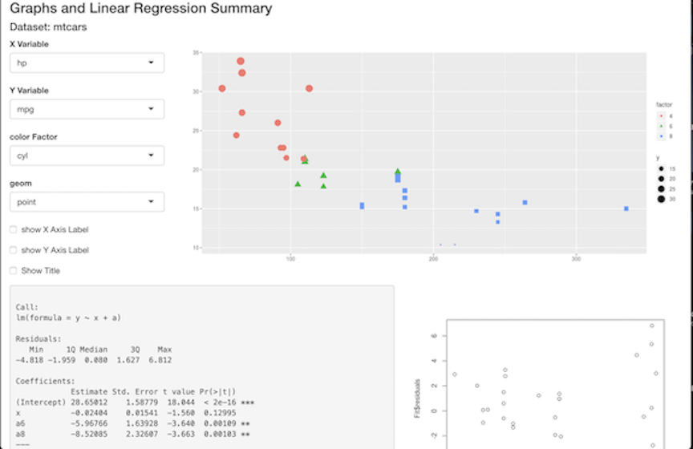

---
output:
  ioslides_presentation: default
  html_document: default
  
---
---
title: "Shiny app and Reproducible Pitch"
author: "Satindra Kathania"
date: "5/20/2020"
output: ioslides_presentation
---

```{r setup, include=FALSE}
knitr::opts_chunk$set(echo = FALSE)
```

## Shiny App : Graphs and Linear Regression Model Summary 

**Shiny applications have two components:**
- a user-interface definition (UI) file called ui.R
- a server script file called server.R

**Objective**
- Develop a Shiny app and deploy on Rstudio's server.
- Prepare R presentation demonstrating the app.

**An overview of the dataset used:** mtcars (11 var,32 obs)
```{r, echo=FALSE,comment=""}
data(mtcars)
head(mtcars,5)
```

## For ui.R
We first start with attaching the libraries: **shiny and ggplot2**

1. **For Page layout:** Inside fluidPage I created 3 fluidRows with diffrent width columns.  

2. **For Inputs:** 4 select inputs (for variables & geom) & 3 checkbox input (for labels)

3. **For outputs:** display 3 outputs

- XY plot, residual vs fitted values plot & Text: Fit summary

**Variable selection choices are:**
```{r,comment=""}
names(mtcars)
```

## For server.R:
**1.In order to display different geom in ggplot outplot**: I made a reactive plot_geom with switching options: 

+ geom_(...): point, smooth,  fit, jitter, violin, box
 
+ Then, I renderplot with ggplot having input chocies of variables, factor/color & plot_geom

**2.For output Fit summary**  renderPrint the linear regression formula as:
- Fit<- lm(y ~ x + a) # "a" being the factor var of choice
- summary(Fit)

**3.For plotFit** renderplot for residual vs fitted values of linear regression model that we have created.


## Final Shiny App
Developed app is available at:https://satindrakathania-2020.shinyapps.io/mtcarsapp/

Source code are available at GitHub Pages: https://satk-ds2020.github.io/DDP-week4-coursera/.

GitHub repository: https://github.com/SatK-ds2020/DDP-week4-coursera

```{r,echo=FALSE,fig.align='center'}

```

